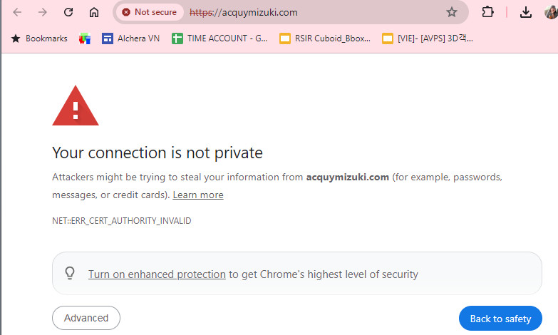
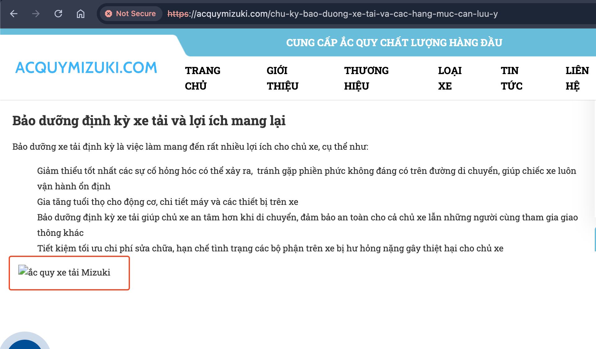
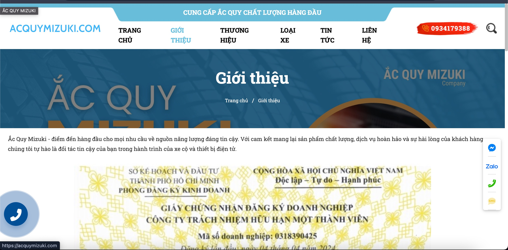
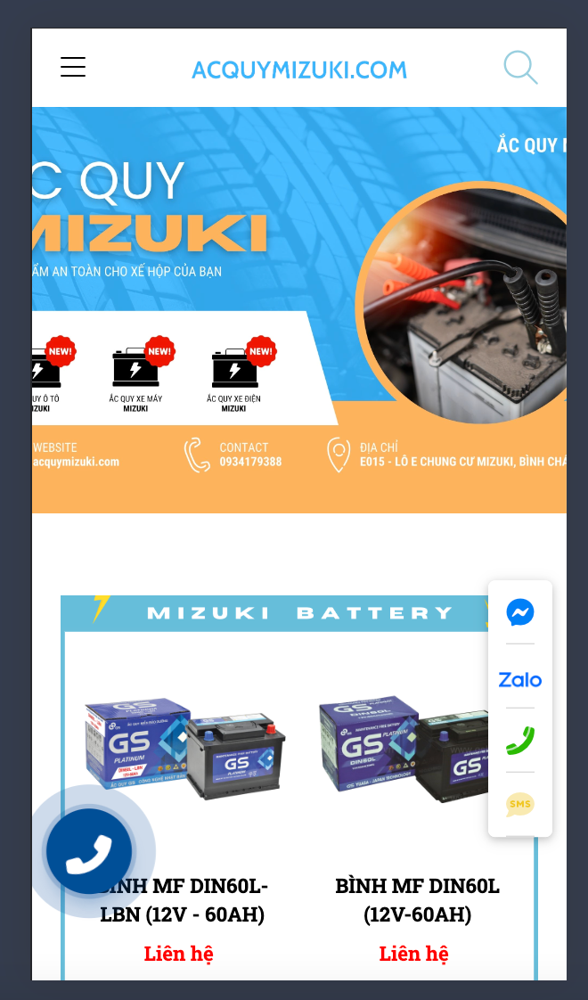

## Các lỗi tồn đọng trên website acquymizuki.com

### 1. Chứng chỉ bảo mật SSL

#### Khi website chưa hoặc không có chứng chỉ bảo mật SSL có thể dẫn đến một hoặc nhiều hậu quả sau:
- Trang web bị chặn truy cập hoặc bị cảnh báo nguy hiểm, gây mất niềm tin của khách.

- Thông tin khách hàng có thể bị đánh cắp.

### 2. Lỗi hiển thị hình ảnh trong bài viết
#### Bài viết có chứa hình ảnh được upload lên máy chủ của bên cung cấp website, khi hiển thị tới khách hàng bị không hiển thị được như hình dưới

### 3. Dàn trang không gọn gàng.
#### Dàn trang và bố cục không hợp lí khiến thông tin không được hiển thị gọn trong màn hình, cần cuộn nhiều lần để đọc hết thông tin.

### 4. Bố cục không tối ưu trên điện thoại.
#### Trang web chưa được tối ưu trên điện thoại, dẫn đến bị ẩn hoặc mất một phần thông tin hiển thị như hình dưới.

### 5. Tốc độ tải trang chậm
#### Tốc độ tải trang chậm có thể do một trong các nguyên nhân sau:
- Máy chủ lưu trữ web tốc độ thấp.
- Hình ảnh chưa được nén dẫn đến dung lượng nặng.
- Code không tối ưu.

### 6. Website không chuẩn SEO.
#### Việc website không chuẩn SEO (Tiêu đề, nội dung, từ khoá, các thẻ metadata ...) ảnh hưởng nặng nề đến việc đưa website lên vị trí cao trong kết quả tìm kiếm Google và các nền tảng tìm kiếm khác.